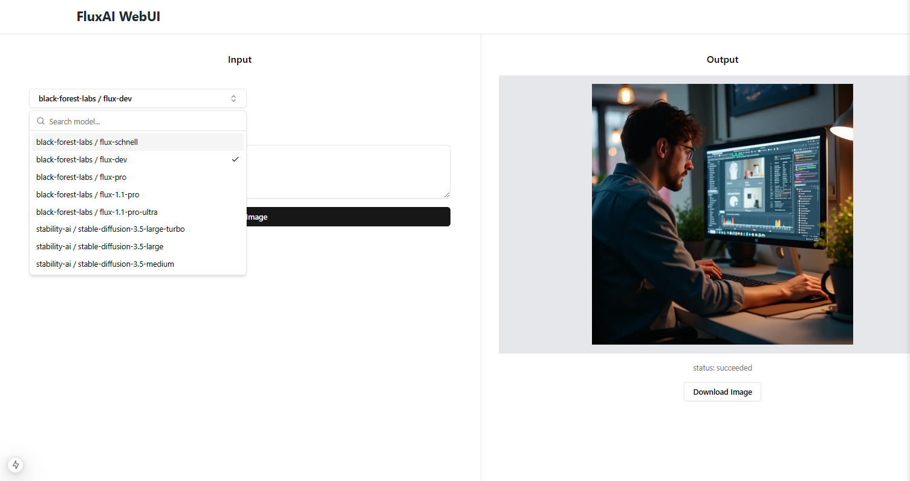

# Flux AI / Stable Diffusion Web UI for Replicate

Flux AI / Stable Diffusion Web UI is an AI-powered image generation platform built using Next.js 15 and the Flux and Stable Diffusion AI models. The platform allows users to create high-quality images from text prompts quickly and easily.



## Supported models

### black-forest-labs
- flux-schnell
- flux-dev
- flux-pro
- flux-1.1-pro
- flux-1.1-pro-ultra

### stability-ai
- stable-diffusion-3.5-large-turbo
- stable-diffusion-3.5-large
- stable-diffusion-3.5-medium


## Getting Started

### Env
First, duplicate the `.env.local.example` file and rename it to `.env.local`. Then, replace the placeholder token value with your actual `REPLICATE_API_TOKEN`.

```bash
cp .env.local.example .env.local
```

### Install dependencies
```bash
npm i
```

### Run it
Run the development server:

```bash
npm run dev
```

Open [http://localhost:3000](http://localhost:3000).

## TODO

- [X] Add other Flux models
- [ ] Add other Flux fields
- [X] Add the possibility to download an image
- [X] Add screenshots
- [ ] Add documentation and Vercel deployment

## Link Me
if this project is helpful to you, buy me a coffee.

[](https://www.buymeacoffee.com/cihancinar)
